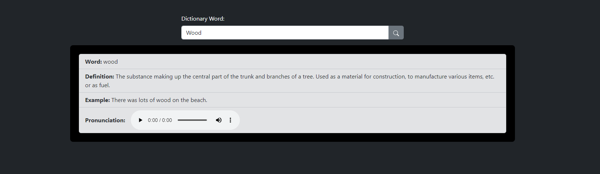

# Dictionary Web Application

## Description

This is a simple web application that allows users to look up the definitions of words in an online dictionary. It's built using HTML, Bootstrap for styling, and JavaScript for the interactive functionality. Users can enter a word, click the search button, and get information about the word, including its definition and pronunciation.

## Features

- Word lookup using an online dictionary API.
- Display of word definitions.
- Optional display of example sentences.
- Pronunciation audio playback.
- Responsive design for various screen sizes.

## Getting Started

1. Clone this repository to your local machine.
2. Open the project's main HTML file (index.html) in a web browser.

## Usage

1. Enter a word in the input field.
2. Click the search button.
3. View the word's definition, example (if available), and pronunciation.

## Dependencies

- [Bootstrap](https://getbootstrap.com/) - Used for styling the web page.
- [Online Dictionary API](https://dictionaryapi.dev) - Provides word definitions.

## Contributing

Feel free to contribute to this project by opening issues or pull requests. Your input is valuable!

## Acknowledgments

- Special thanks to [Bootstrap](https://getbootstrap.com/) for making web styling easy.
- Thanks to the [Online Dictionary API](https://dictionaryapi.dev) for providing word definitions.

## Contact

If you have questions or want to get in touch, you can reach me at hussainmurtaza760@gmail.com.

## Additional Information

Include any additional information or instructions here, such as setting up the development environment, configuration, or deployment.
